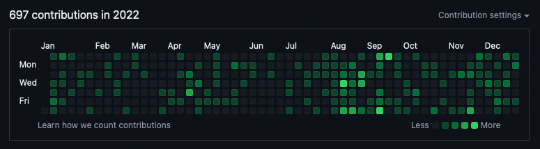
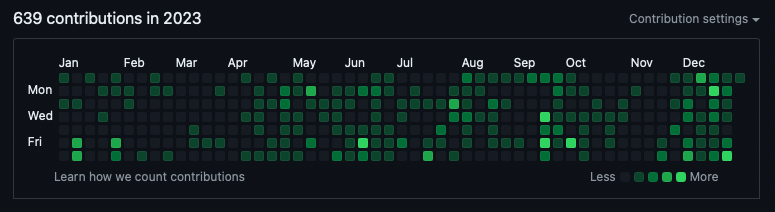
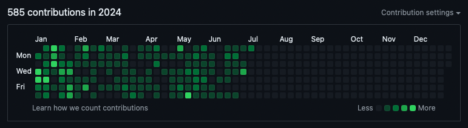

# Hi! I'm Tim Smith 👋

Husband, Developer, and Lover of Life 💖

---

**Senior Frontend Developer** with 8+ years of experience crafting engaging, high-performance web applications. I specialize in **Svelte**, **React** and **Next.js**, building mobile-first, user-centric designs that drive user engagement and deliver results.

## 🚀 Skills

- **Frontend Expertise:** React, Next.js, Svelte, Redux, HTML, CSS, JavaScript
- **Backend & More:** Node.js, Python, Ruby on Rails, REST APIs, JSON
- **Tools & Workflow:** Git, Unit Testing, WCAG 2.x Compliance, Figma, Jenkins, VSCode, FireBug

---

**2022**

**2023**

**2024**

---

## ✨ About Me

I'm a passionate problem-solver and lifelong learner. My journey includes formal education and a strong emphasis on self-directed learning. I thrive on experimentation, diving into code, and constantly expanding my knowledge.

**What Sets Me Apart:**

- **Proven Results:** Delivered 50+ websites as a freelancer, boosting SEO, UX, and client engagement.
- **Impactful Contributions:** Improved conversion rates by 20% at GAP, INC. through streamlined checkout and led a successful transition to microservices.
- **Collaborative Spirit:** Excel in cross-functional teams, mentoring junior developers and ensuring seamless integration between frontend and backend.

---

## 🤝 Let's Connect!

I'm always excited to connect with fellow developers, explore new opportunities, and collaborate on innovative projects. Feel free to reach out through my website or LinkedIn.

---

## 🔍 More About Me

- **LinkedIn:** [timsmith25](https://linkedin.com/timsmith25)
- **Portfolio:** [timsmith.tech](https://Timsmith.tech)
- **Old GitHub Account:** [webruin](https://github.com/webruin)

## 🌱 Currently...

- **Working on:**

- [TransparentUI Svelte Library](https://github.com/timscodebase/trans-ui-lib)

- **Learning:**

  - [HTMX](https://htmx.org)
  - [TypeScript](https://www.typescriptlang.org)
  - [JSDocs](https://jsdoc.app)
